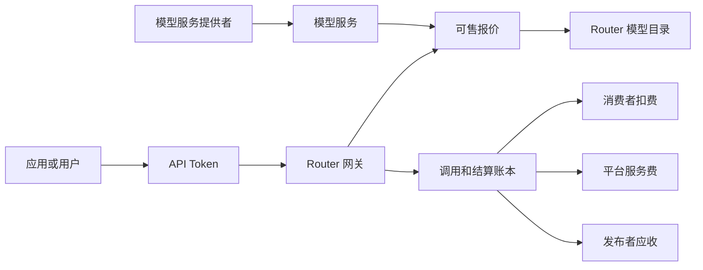
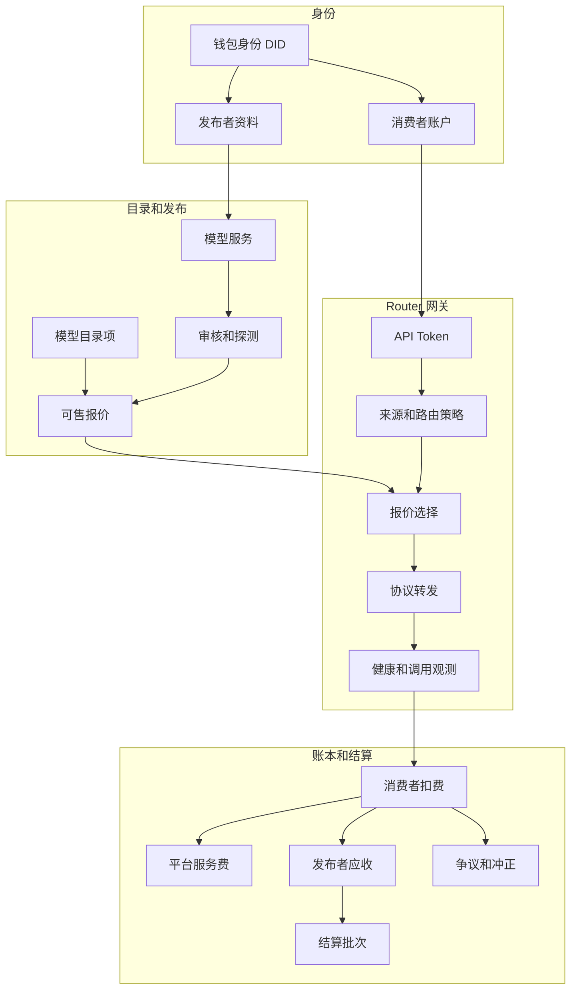
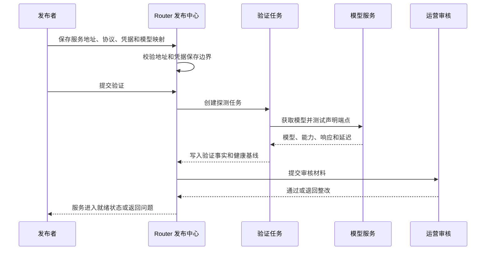
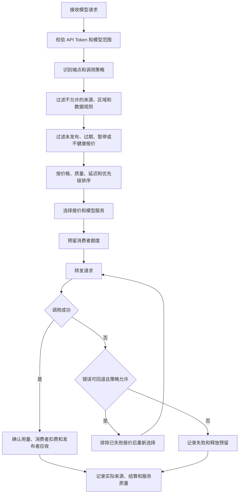
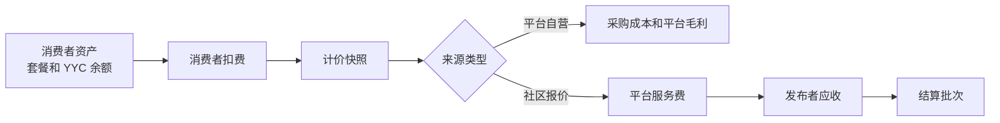

# 开放模型服务网关方案

## 文档状态

- 状态：设计基线，尚未实现
- 适用范围：Router 的模型服务发布、消费、路由、计量、结算和治理
- 不替代：当前 [模型路由架构](../模型路由/模型路由架构.md)、[渠道规范](../模型渠道/渠道规范.md)、[计费架构](../商业计费/计费架构.md)
- 当前实现基线：平台运营人员维护供应商、渠道、分组和套餐；用户可以保存仅供自己使用的个人连接

## 1. 目标和定位

Router 的目标是成为夜莺社区的开放模型服务网关。

模型服务提供者可以在 Router 发布自己有权提供的模型服务。应用和用户通过一个兼容 OpenAI 的 API 入口调用模型。Router 负责身份、访问控制、模型发现、协议转发、来源选择、服务质量、用量计量、消费者扣费、平台服务费、发布者结算和争议治理。

平台自营服务、社区发布服务和用户私有连接都可以使用同一套网关能力，但它们的所有权、可见性、责任和结算规则不同。



Router 向消费者提供的核心承诺是：

1. 一套稳定 API 和 Token，可以访问符合授权范围的模型服务。
2. 对每次调用说明实际使用的模型服务、来源、失败重试和结算结果。
3. 当同一模型有多项可售服务时，按用户策略、服务质量、价格、区域和数据规则选择来源。
4. 发布者可看到自己的服务质量、使用量、收入、争议和结算状态。

## 2. 范围

本方案建设的是“模型服务发布和调用结算平台”。它允许发布者提供模型推理服务或经过授权的模型访问服务。

第一阶段允许的供给形式：

1. 发布者自己部署并运营的开源模型或微调模型。
2. 发布者拥有明确商业授权的云端模型服务、推理节点或代理服务。
3. 平台自营的模型服务。

第一阶段不允许把普通用户的个人 API Key、个人订阅或闲置 Token 直接作为公共供给发布。个人连接仍只属于连接所有者。原因是个人上游凭据通常无法证明可转售权利，且无法承担容量、数据、账单和争议责任。

“个人连接升级为公开服务”不是一个开关。希望成为发布者的用户必须完成发布者准入，并创建独立的模型服务和可售报价。

以下事项不属于首期范围：

1. 托管模型权重、训练任务、GPU 租赁或模型文件分发。
2. 允许匿名发布者自动上线。
3. 使用个人 Key 的容量转售。
4. 多级分销、二次转售和发布者之间的转包。
5. 智能合约自动结算。首期以平台账本和审核结算为准。

## 3. 设计原则

### 3.1 模型、服务和报价分离

模型是用户请求的能力标识；模型服务是实际可调用的运行实例；可售报价是发布者向消费者提供服务的商业声明。

同一个模型可以有多个服务和多个报价。消费者请求模型时，Router 在符合条件的报价中选择服务。

```text
模型：qwen3-coder
  服务 A：平台集群，OpenAI 协议，北京区域
  服务 B：社区发布者 node-alpha，自托管集群，上海区域
  服务 C：社区发布者 team-beta，已授权云服务，新加坡区域

报价 A：平台自营，稳定优先
报价 B：社区标准，低价优先
报价 C：社区企业，区域和数据策略受限
```

### 3.2 个人连接、发布服务和平台渠道分离

| 对象 | 所有者 | 谁可使用 | 是否可售 | 结算方式 |
| --- | --- | --- | --- | --- |
| 平台渠道 | 平台 | 平台授权的消费者 | 是 | 平台收入和上游采购成本 |
| 发布服务 | 已审核发布者 | 符合报价范围的消费者 | 是 | 消费者扣费、平台服务费、发布者应收 |
| 个人连接 | 某个 Router 用户 | 该用户的 API Token | 否 | 不扣社区资产，不产生发布者收入 |

个人连接继续使用 `personal_provider_connections`。发布服务必须使用独立对象和独立凭据边界，不能复用或公开个人连接记录。

### 3.3 平台只撮合可验证的供给

Router 不以发布者自述作为服务真值。公开报价进入可选路由范围前，必须同时满足：

1. 发布者已通过当前级别的准入。
2. 服务地址、协议、认证方式和模型映射已保存。
3. 模型与端点探测成功。
4. 服务健康状态满足上线阈值。
5. 报价、结算主体、数据规则和服务范围已明确。
6. 平台审核通过。

### 3.4 请求来源和数据去向可解释

消费者调用公开模型时，Router 必须记录并在调用记录中展示：

1. 请求模型和实际模型。
2. 最终命中的报价、发布者和服务。
3. 是否发生同来源重试或跨报价回退。
4. 消费者实际扣费、平台服务费和发布者应收快照。
5. 适用的数据处理规则和区域。

消费者可以按 Token 或调用策略限制来源，例如仅平台、允许社区、仅指定发布者、仅指定区域。服务质量优先不能绕过这些限制。

### 3.5 人工配置和运行事实分离

沿用现有渠道治理原则：发布者和运营人员保存的服务配置、报价、价格和数据规则是人工配置；健康检查、探测结果、调用失败、延迟和用量是运行事实。

运行事实可以使报价降权、暂停或进入审核，但不能静默修改发布者的服务地址、模型声明、价格或数据规则。

## 4. 核心概念

### 4.1 发布者

发布者是可对外提供模型服务并参与结算的主体。一个发布者关联一个钱包身份 DID，也可以关联经审核的组织资料和结算资料。

发布者不是“供应商”的同义词：

- 供应商描述模型原始来源，例如 OpenAI、Anthropic、Qwen 或开源项目。
- 发布者描述谁向 Router 消费者提供某项具体服务。

发布者状态：

| 状态 | 含义 | 可创建服务 | 可发布报价 | 可结算 |
| --- | --- | --- | --- | --- |
| `draft` | 已创建资料，未提交审核 | 是 | 否 | 否 |
| `reviewing` | 等待或正在审核 | 是 | 否 | 否 |
| `active` | 已通过审核 | 是 | 是 | 是 |
| `restricted` | 受限，需整改或补充资料 | 是 | 否 | 视结算冻结规则而定 |
| `suspended` | 已暂停服务资格 | 否 | 否 | 仅允许处理历史结算和争议 |
| `closed` | 已关闭 | 否 | 否 | 仅保留审计记录 |

### 4.2 模型目录项

模型目录项是 Router 对外可发现的模型标识和能力元数据。分为两类：

| 类型 | 示例 | 名称规则 | 来源 |
| --- | --- | --- | --- |
| 标准模型 | `gpt-5.1`、`qwen3-coder` | 使用稳定的标准模型 ID | 官方供应商目录或平台维护 |
| 社区模型 | `community/alice/legal-assistant-v1` | `community/{publisher-slug}/{model-slug}` | 发布者提交，平台审核 |

社区模型必须使用命名空间，避免与标准模型或其他发布者模型冲突。`latest` 这类浮动别名不作为可计费的社区模型 ID；发布者需要通过新版本发布来表达模型更新。

模型目录项声明能力和兼容范围，但不直接表示某个服务已经可用。真正可调用能力来自当前授权范围内的有效报价。

### 4.3 模型服务

模型服务是发布者运营的一项实际推理服务。它可映射到 Router 当前的渠道运行能力，但必须拥有独立的发布者归属和生命周期。

建议字段：

| 字段 | 含义 |
| --- | --- |
| `id` | 服务唯一 ID |
| `publisher_id` | 所属发布者 |
| `service_name` | 发布者内部可读名称 |
| `protocol` | OpenAI、Anthropic、Gemini 等接入协议 |
| `base_url` | 经过 SSRF 校验的服务地址 |
| `credential_ref` | 加密凭据引用，不通过读取接口返回 |
| `region` | 服务实际处理区域 |
| `data_policy` | 数据保留、训练使用、日志边界等声明 |
| `capacity_policy` | 并发、速率、日预算和自用保护规则 |
| `status` | 草稿、验证中、就绪、暂停、下线 |
| `verification_summary` | 最近探测结果摘要 |

一个模型服务可以承载多个模型和多个端点；每个模型映射都需要独立记录上游模型 ID、端点、能力、计量方式和验证结果。

### 4.4 可售报价

可售报价是公开路由和商业结算的最小单位。消费者不直接购买“渠道”，而是购买某个模型服务在特定条件下提供的调用能力。

建议字段：

| 字段 | 含义 |
| --- | --- |
| `id` | 报价唯一 ID |
| `publisher_id` | 收款和履约主体 |
| `service_id` | 实际承载的模型服务 |
| `model_id` | 对外模型 ID |
| `scope` | 公开、受邀、组织专属或平台专属 |
| `consumer_price` | 消费者价格规则 |
| `publisher_price` | 发布者结算价格规则或分成规则 |
| `platform_fee_rule` | 平台服务费规则版本 |
| `region_policy` | 可服务区域和区域限制 |
| `data_policy` | 消费者可见的数据规则版本 |
| `quality_policy` | 最低成功率、延迟、容量和暂停阈值 |
| `effective_from` / `effective_to` | 价格和可售时间窗口 |
| `status` | 草稿、审核中、已发布、暂停、下线 |

同一服务针对同一模型可以有多个报价，例如公开报价、受邀报价和组织专属报价，但同一消费者上下文内必须能确定唯一价格和优先顺序。

### 4.5 调用、结算和争议

调用是一个技术事实；结算是调用成功后的财务事实；争议是对既有调用或结算进行复核和调整的治理对象。

三者必须可追溯地关联，但不能互相覆盖：

```text
调用日志
  -> 调用计量快照
  -> 消费者扣款分录
  -> 平台服务费分录
  -> 发布者应收分录
  -> 结算批次
  -> 争议或冲正分录
```

## 5. 目标架构



### 5.1 对当前对象的演进

| 当前对象 | 当前职责 | 开放供给后的处理 |
| --- | --- | --- |
| `Provider` | 官方供应商和官方模型信息 | 继续作为模型来源目录，不承载发布者身份或收益归属 |
| `ProviderModel` | 官方模型、端点、能力和官方价格 | 继续维护标准模型信息；社区模型增加独立目录项 |
| `Channel` | 平台实际调用的上游连接 | 继续作为运行时连接能力；增加明确所有者类型和归属引用，或由发布服务持有同类运行配置 |
| `group_models` | 分组暴露模型 | 平台套餐继续使用；公开报价不应直接依赖消费者分组表达可售关系 |
| `group_channels` | 分组内渠道和倍率 | 平台自营服务继续使用；公开报价使用 Offer 规则和运行时候选池 |
| `PersonalProviderConnection` | 用户私有连接 | 保持私有，不参与公开目录、公共候选池或发布者结算 |
| `Log` | 请求、路由和扣费观测 | 扩展关联报价、发布者、服务、价格和结算快照 |

### 5.2 运行时候选池

消费者请求某模型时，Router 不能把所有同名服务直接混为候选。必须按以下顺序收敛候选范围：

1. API Token 的模型范围和消费者权限。
2. 请求端点与模型能力兼容性。
3. Token 或调用策略允许的来源类型。
4. 区域、数据规则、组织范围和发布者限制。
5. 当前已发布、未过期、未暂停的报价。
6. 报价服务的健康、容量和限流状态。
7. 价格、质量、延迟和消费者偏好。

候选池至少分三类：平台自营、社区发布和个人连接。个人连接只在连接所有者的请求中进入候选池，不能进入公开候选池。

## 6. 发布流程

### 6.1 发布者准入

发布者注册使用钱包身份 DID。不同风险等级可以要求不同资料：

| 等级 | 可提供范围 | 准入要求 | 结算规则 |
| --- | --- | --- | --- |
| `verified_community` | 受邀或小范围公开的自托管模型 | DID、联系邮箱、人工审核、服务验证 | 小额度、较长结算冻结期 |
| `verified_business` | 公开模型服务、授权渠道 | 主体资料、授权说明、结算资料、人工审核 | 标准账期和风险预留 |
| `platform` | 平台自营服务 | 平台内部权限 | 平台内部账务 |

发布者身份验证不等于模型服务审核。身份审核确认“谁在负责”，服务审核确认“提供的服务是否符合声明”。

### 6.2 服务验证

发布者创建服务后，Router 进行验证：



验证至少检查：

1. 地址可达且不指向内网、回环、链路本地或保留地址。
2. 服务协议与实际响应一致。
3. 发布模型和上游模型映射有效。
4. 声明端点可以完成最小可用请求。
5. 响应格式、模型标识、计量字段符合协议。
6. 延迟、错误码和限流行为可观测。
7. 数据区域和数据规则声明已填写。

### 6.3 报价发布

服务验证通过后，发布者创建报价。报价需要经过四个阶段：

```text
草稿 -> 提交审核 -> 已发布 -> 暂停或下线
                 \-> 退回整改 -> 草稿
```

报价审核通过后才进入消费者模型目录和公开候选池。报价更新价格、区域或数据规则时，必须产生新版本；已开始的调用和已生成的账务记录继续引用旧版本快照。

### 6.4 下线和退出

发布者可以请求下线报价。下线后：

1. 新请求不再选择该报价。
2. 已固定的有状态会话继续遵循会话固定规则；如果服务已不可用，则明确失败，不迁移到不满足数据或来源约束的服务。
3. 未结算调用、退款窗口和争议记录继续保留。
4. 服务配置、调用日志和账务快照按审计期限保留。

平台可因验证失败、服务质量、数据规则违约、欺诈或争议暂停报价，并记录可复核的原因。

## 7. 消费和选路流程

### 7.1 用户可理解的来源策略

消费者不应理解渠道、分组或内部权重。其可见来源策略建议只有：

| 策略 | 含义 |
| --- | --- |
| 平台服务 | 仅使用平台自营服务 |
| 社区服务 | 允许已审核的社区发布服务 |
| 个人连接 | 仅使用自己的私有连接 |
| 自动选择 | 在 Token 允许的来源范围内按规则选择 |
| 指定发布者 | 仅选择指定发布者的报价 |

策略还应支持两类独立约束：

1. 数据约束：区域、数据保留、训练使用和日志要求。
2. 成本与质量偏好：最低价格、稳定优先、低延迟优先。

来源约束优先于质量和价格。一个不符合数据规则的低价服务不能进入候选池。

### 7.2 无状态文本请求



### 7.3 有状态请求

Responses、异步视频、文件、Realtime 等会生成或引用上游资源的端点必须固定服务来源。

首次请求成功后，Router 保存：

```text
消费者上下文 + 上游资源 ID -> 报价 ID + 模型服务 ID + 实际上游连接 ID
```

后续请求必须回到同一服务。不能因为价格、策略更新、套餐变化或服务短暂异常把会话转移到其他发布者。服务永久不可用时，Router 返回需要重新开始会话的明确错误。

### 7.4 回退规则

回退分为两类：

1. 同一报价内的运行重试，例如连接抖动后重试同一服务。
2. 跨报价回退，例如报价 A 因可回退错误失败后选择报价 B。

跨报价回退必须同时满足：

1. 请求无状态，或尚未绑定任何上游资源。
2. 消费者策略允许该来源类型。
3. 后备报价满足同样的模型、端点、区域和数据规则。
4. 错误属于可回退错误。
5. 后备报价仍在当前预算和权益范围内。

回退时调用记录必须完整记录失败报价、失败原因、最终报价和最终结算结果。

## 8. 定价、计量和结算

### 8.1 三份价格必须分开

开放供给中不能用一个“成本”字段表达全部经济关系。一项成功调用至少要保存：

| 价格 | 谁定义 | 用途 |
| --- | --- | --- |
| 消费者价格 | 报价规则和平台定价规则 | 向消费者扣费 |
| 平台服务费 | 平台规则版本 | 平台收入和服务成本覆盖 |
| 发布者结算价 | 报价规则或分成规则 | 形成发布者应收 |

关系如下：

```text
消费者实付
- 支付手续费和依法应计税费
- 平台服务费
- 风险预留
= 发布者可结算收入
```

平台服务费不得在事后用不可解释的方式改写。每次调用固定保存规则版本、各项金额、计量单位和汇率快照。

### 8.2 计量

不同模型类型使用不同计量单位：

| 模型形态 | 常见计量单位 |
| --- | --- |
| 文本、嵌入 | 输入 token、输出 token、缓存 token |
| 图片 | 图片张数、分辨率、质量参数 |
| 音频 | 字符、分钟、音频 token |
| 视频 | 秒数、任务、分辨率和生成参数 |
| 其他异步任务 | 任务数或服务声明的计量单位 |

发布者提交报价时必须声明每个模型端点的计量规则。Router 验证响应能否提供可靠用量；无法可靠计量的服务只能使用经平台允许的按请求计价，且需要更严格的上限和争议规则。

### 8.3 账本分录

建议新增不可变的结算分录，而不是仅更新一个余额字段：

| 分录类型 | 借方 | 贷方 | 触发时点 |
| --- | --- | --- | --- |
| `consumer_reservation` | 消费者可用余额 | 消费者预留 | 请求开始 |
| `consumer_charge` | 消费者预留 | 平台待分配收入 | 请求成功结算 |
| `platform_fee` | 平台待分配收入 | 平台服务费收入 | 请求成功结算 |
| `publisher_payable` | 平台待分配收入 | 发布者应收 | 请求成功结算 |
| `consumer_release` | 消费者预留 | 消费者可用余额 | 请求失败或未使用预留 |
| `refund` | 平台或发布者待处理金额 | 消费者可用余额 | 退款或争议支持 |
| `publisher_adjustment` | 发布者应收 | 平台争议准备金 | 争议或冲正 |

现有套餐和余额是消费者扣费来源，可以继续使用。开放供给增加的是请求结算后的平台和发布者分配，不应改写用户资产模型。

### 8.4 结算批次

发布者结算按批次执行。首期建议使用固定账期和人工审核：

1. 每个调用先生成发布者应收，不立即提现。
2. 账期结束后，排除仍处于退款窗口、争议期、异常检测期或风控冻结期的分录。
3. 生成结算批次，发布者确认结算明细。
4. 平台执行付款或链上转账，并写入不可变的支付凭据。
5. 已支付分录不可修改，只能用补充调整分录修正。

不同发布者等级可以有不同的风险预留比例和结算周期。规则必须在报价或发布者等级变更前公开，不能追溯性修改已结算调用。

## 9. 服务质量和容量治理

### 9.1 服务质量指标

报价的公开候选资格至少使用：

1. 成功率。
2. 首字节延迟和完整响应延迟。
3. 限流和超时比例。
4. 计量完整率。
5. 模型和端点验证状态。
6. 发布者争议率和违规状态。

质量指标用于运行时排序、降权和暂停，不直接等同于发布者信用结论。指标样本不足时应显示“样本不足”，不能伪造稳定性评分。

### 9.2 容量和自用保护

发布者必须能够声明：

1. 每个服务和模型的最大并发。
2. 每分钟或每天的最大请求、token 或任务量。
3. 可供公共消费者使用的容量上限。
4. 自己或指定组织的保留容量。
5. 触发容量阈值时的行为：降权、暂停新请求或只允许已固定会话。

Router 应在请求前执行容量预留，在请求结束后释放或确认。发布者不能通过临时把所有请求返回限流来规避已经承诺的可售容量；持续容量失配会触发报价暂停和审核。

### 9.3 健康状态

报价运行状态建议独立于发布状态：

| 发布状态 | 运行状态 | 是否可进入候选池 |
| --- | --- | --- |
| 已发布 | 健康 | 是 |
| 已发布 | 降权 | 是，排序靠后 |
| 已发布 | 容量不足 | 否，除已固定会话 |
| 已发布 | 验证失败 | 否 |
| 暂停 | 任意 | 否 |
| 下线 | 任意 | 否 |

## 10. 数据、隐私和安全边界

### 10.1 消费者知情和选择

消费者在允许社区服务前，应能看到：

1. 调用可能由平台自营或已审核社区发布者处理。
2. 每项报价的数据区域、数据保留、是否用于训练和日志规则。
3. API Token 是否允许社区来源和跨发布者回退。

对于敏感场景，消费者必须能创建“仅平台”“仅指定发布者”或“仅个人连接”的 Token。Router 不应默认把这类请求回退到不受信任来源。

### 10.2 发布者最小权限

发布者只能看到完成服务运营和结算所需的数据：

1. 聚合调用量、计量、错误码、延迟和结算金额。
2. 发生争议时按最小必要原则提供的请求标识和诊断证据。

发布者不能通过 Router 管理端浏览消费者完整提示词、API Token、钱包身份凭证或其他发布者信息。若 Router 需要短期保存请求内容用于转发或纠错，应由独立的数据保留策略控制，且不将内容开放给发布者。

### 10.3 服务地址和凭据安全

发布服务使用和个人连接相同级别的基础安全约束：

1. 仅允许经过校验的公网 HTTPS 地址或平台已批准的专线地址。
2. 禁止内网、回环、链路本地、保留地址、重定向绕过和代理二次解析绕过。
3. 调用凭据加密保存，只在转发时解密，不通过读取接口或日志返回。
4. 发布者凭据、消费者 Token 和平台运维凭据彼此隔离。

### 10.4 审计

以下行为必须审计：

1. 发布者资料、服务、模型映射、报价、价格、数据规则和容量规则的创建、修改、审核、暂停和下线。
2. 每次路由的实际报价、服务、发布者、失败尝试和回退。
3. 每笔消费者扣费、平台服务费、发布者应收、退款、调整和支付。
4. 所有审核和争议决定的操作者、依据和时间。

## 11. 后台和用户界面

### 11.1 发布者工作区

发布者工作区建议提供：

1. 发布者资料：身份状态、结算资料、服务等级和限制。
2. 模型服务：服务地址、协议、凭据轮换、模型映射、验证和健康状态。
3. 报价：价格、区域、数据规则、容量规则、发布状态和版本记录。
4. 运行概览：调用量、成功率、延迟、限流、容量使用和异常。
5. 收益：预估收入、冻结金额、可结算金额、已结算金额和结算批次。
6. 争议：退款、申诉、整改和处理结果。

### 11.2 消费者工作区

消费者工作区建议提供：

1. 模型目录：区分平台服务、社区服务、个人连接可用模型。
2. 模型详情：能力、端点、价格、可用来源、服务质量、区域和数据规则。
3. API Token：模型范围、来源约束、成本上限、数据约束和路由偏好。
4. 调用记录：最终发布者、报价、服务来源、回退过程、扣费和数据规则快照。
5. 个人连接：继续只管理用户私有凭据，不出现“公开共享”开关。

### 11.3 平台运营工作区

平台运营工作区建议提供：

1. 发布者审核队列和风险状态。
2. 服务验证任务和健康告警。
3. 报价审核、价格异常、数据规则和容量审查。
4. 跨发布者模型质量、调用量、消费者退款和争议分析。
5. 发布者应收、结算批次、冻结和支付记录。

## 12. API 设计方向

本节定义资源边界，不替代后续 OpenAPI 契约。

### 12.1 发布者资源

```text
GET  /api/v1/public/publisher/profile
PUT  /api/v1/public/publisher/profile
POST /api/v1/public/publisher/applications
GET  /api/v1/public/publisher/services
POST /api/v1/public/publisher/services
GET  /api/v1/public/publisher/services/{id}
PUT  /api/v1/public/publisher/services/{id}
POST /api/v1/public/publisher/services/{id}/verify
GET  /api/v1/public/publisher/offers
POST /api/v1/public/publisher/offers
PUT  /api/v1/public/publisher/offers/{id}
POST /api/v1/public/publisher/offers/{id}/submit
GET  /api/v1/public/publisher/settlements
GET  /api/v1/public/publisher/disputes
```

### 12.2 消费者资源

```text
GET /api/v1/public/model-catalog
GET /api/v1/public/model-catalog/{model}
GET /api/v1/public/model-catalog/{model}/offers
GET /api/v1/public/routing/preview
GET /api/v1/public/log/{id}
```

`routing/preview` 只返回消费者有权查看的来源类型、价格区间、数据规则和预期选择理由，不返回其他发布者的凭据、内部容量或敏感运营信息。

### 12.3 管理资源

```text
GET  /api/v1/admin/publishers
POST /api/v1/admin/publishers/{id}/approve
POST /api/v1/admin/publishers/{id}/restrict
GET  /api/v1/admin/publisher-services
POST /api/v1/admin/publisher-services/{id}/suspend
GET  /api/v1/admin/offers/review
POST /api/v1/admin/offers/{id}/approve
POST /api/v1/admin/offers/{id}/reject
GET  /api/v1/admin/settlements
POST /api/v1/admin/settlements/{id}/approve
POST /api/v1/admin/disputes/{id}/resolve
```

## 13. 数据模型建议

建议新增以下表或等价持久对象：

| 对象 | 主键和关联 | 关键字段 |
| --- | --- | --- |
| `publishers` | `id`，关联 `user_id`、DID | 状态、主体类型、等级、结算状态、风险状态 |
| `publisher_services` | `id`，关联 `publisher_id` | 协议、地址、凭据引用、区域、数据规则、状态 |
| `publisher_service_models` | `service_id + model_id + endpoint` | 上游模型、计量规则、能力、验证状态 |
| `model_catalog_entries` | `model_id` | 类型、命名空间、展示资料、状态、归属供应商或发布者 |
| `service_offers` | `id`，关联发布者、服务、模型 | 范围、价格、平台费规则、容量、数据规则、发布状态、版本 |
| `offer_health_snapshots` | `offer_id + observed_at` | 成功率、延迟、错误分类、容量、样本数 |
| `offer_capacity_reservations` | `offer_id + request_id` | 预留单位、状态、过期时间 |
| `publisher_payables` | `id`，关联调用和报价 | 应收金额、冻结状态、可结算时间、调整关联 |
| `settlement_batches` | `id`，关联发布者 | 账期、金额、状态、支付凭据 |
| `settlement_entries` | `batch_id + payable_id` | 分录金额、扣减原因、状态 |
| `service_disputes` | `id`，关联调用和分录 | 发起方、原因、证据、处理结果 |
| `publisher_audit_logs` | `id` | 审核、配置、状态和结算操作审计 |

所有金额字段应使用整数最小单位或定点数，不能用二进制浮点数表示最终结算金额。价格和结算规则必须带版本号，调用日志保存规则快照而非只保存外键。

## 14. 与当前计费体系的衔接

当前 Router 的“销售层、计价层、采购层”仍然适用于平台自营服务。开放供给需要在此基础上增加“发布者结算层”。



平台自营请求保留现有采购成本计算路径。社区报价请求不应伪造为平台采购成本；它应记录发布者结算价、平台服务费和发布者应收。财务报表需要能分别查看：

1. 平台自营收入、采购成本和毛利。
2. 社区服务消费者收入、平台服务费收入和待结算发布者应收。
3. 退款、争议、风险预留和结算调整。

## 15. 实施阶段

### 阶段 A：可信发布试点

目标是验证供给和消费是否成立，不开放自由市场。

1. 仅允许平台邀请的已审核发布者。
2. 仅支持无状态文本和嵌入端点。
3. 创建发布者、模型服务、服务验证和固定价格报价。
4. 公开目录区分平台服务和社区服务。
5. 消费者调用记录展示最终发布者、报价、来源和扣费。
6. 平台服务费采用固定规则，发布者按人工审核的结算批次收款。
7. 仅支持平台余额或指定套餐消费，不做复杂的跨来源自动回退。

验收信号：至少存在稳定发布服务、真实消费者调用、可核对账本和一次完成的发布者结算。

### 阶段 B：多报价路由

目标是让同一模型的多项服务在可控规则下竞争。

1. 增加报价级健康、容量、延迟和成功率。
2. 支持自动选择、平台优先、社区优先和指定发布者。
3. 支持符合数据规则的跨报价回退。
4. 提供消费者路由预览和完整的调用解释。
5. 发布者工作区展示质量、用量和预估应收。

验收信号：多项报价下的路由、回退、价格和结算均能由调用日志复核。

### 阶段 C：受治理的自助发布

目标是逐步扩大供给方范围。

1. 自助申请发布者资格。
2. 分级审核、限额、风险预留和自动化验证。
3. 报价版本、容量保护、异常检测和自动暂停。
4. 争议、退款、申诉和发布者信用机制。
5. 结算自动化和支付状态对账。

验收信号：普通合格发布者可以在无需人工配置渠道的情况下完成发布、运营和结算；平台仍可审计、暂停和处理争议。

### 阶段 D：扩大协议和服务类型

目标是逐步支持有状态和多媒体服务。

1. Images、Audio、Video、Files、Batch、Realtime 的服务验证与计量。
2. 上游资源绑定、任务查询、取消和结果下载的服务归属规则。
3. 每类端点独立定义可回退边界和争议证据。

## 16. 关键决策

1. Router 的公开供给单位是“可售报价”，不是“个人 API Key”或“渠道”。
2. 个人连接永远是私有资源；公开供给使用独立模型服务对象。
3. 标准模型和社区模型使用不同命名规则；社区模型必须带发布者命名空间。
4. 服务验证、报价审核、运行健康和发布者准入是四个独立状态，不能用一个开关替代。
5. 消费者价格、平台服务费和发布者应收必须分别入账并保存调用快照。
6. 有状态请求固定到首个成功服务，不能跨发布者迁移。
7. 数据规则、区域和来源约束先于价格、延迟和成功率。
8. 首期只面向可信发布者和可验证服务，先建立真实结算闭环，再开放自助发布。

## 17. 后续设计输入

本方案确认后，后续需要分别沉淀：

1. 发布者准入和风险分级规则。
2. 模型服务验证契约和端点测试规范。
3. 可售报价定价、版本和容量规则。
4. 消费者来源策略和路由预览契约。
5. 发布者账本、结算、退款和争议规则。
6. 发布者工作区、消费者模型目录和运营审核界面设计。
7. 对应的 OpenAPI、数据库 migration 和测试计划。

