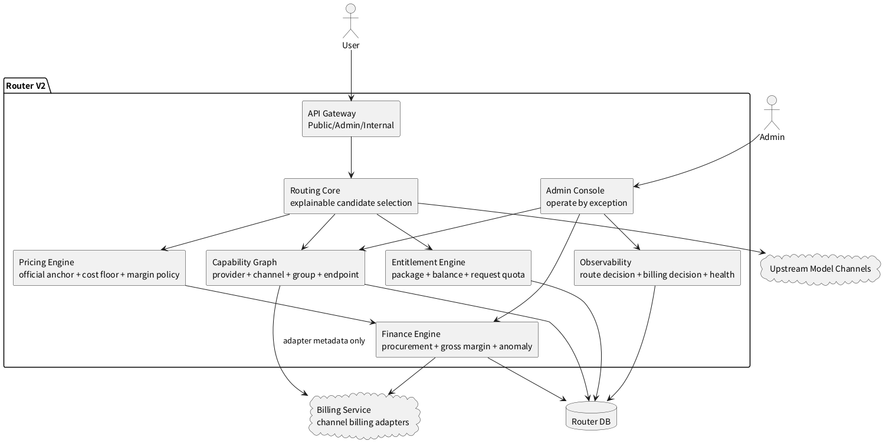
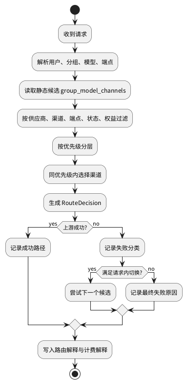
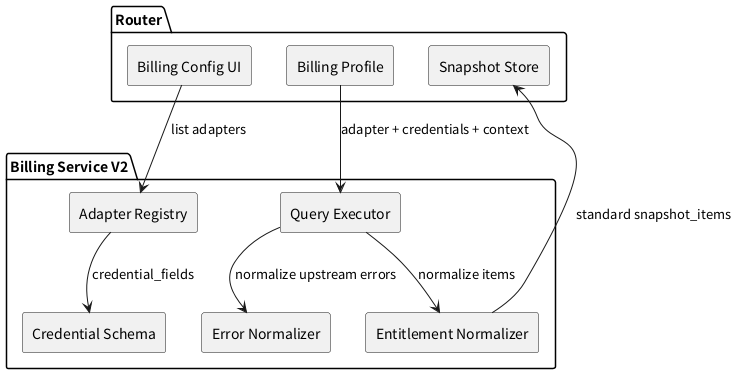

# 路由架构 V2

版本：`2026-08-02`  
状态：实施中

本文档只放未实现或未完全收敛的目标架构。当前已落地基线见 [路由架构 V1](./路由架构V1.md)。

## 1. V2 目标

V2 不追求继续堆页面和数据，而是把 Router 运营起来需要的关键链路收敛清楚：

1. 路由治理更可解释：为什么某个模型可用、为什么某个渠道被选中、为什么请求切换或失败。
2. 财务分析更可信：收入、采购成本、毛利、未配置成本可以稳定解释。
3. 文档体系更少而清楚：当前事实写入当前文档，近期规划进入 V2，长期路线进入 V3，历史材料合并或删除。
4. Billing 边界更稳定：渠道账务 adapter 只在 Billing 服务内扩展，Router 不出现厂商私有账务文案。

## 2. 实施进度

V2 按可验证的小阶段推进，当前已完成：

1. 模型健康信号区分真实调用、渠道检测和无信号，不再把检测结果解释为调用样本。
2. 请求日志保存结构化 `RouteDecision`，记录选路来源、候选渠道、选择方式、优先级、初始渠道和最终渠道。
3. 请求切换继续使用结构化 `fallback_attempts`，运营日志详情可同时查看初始选路和每次失败尝试。
4. 采购成本归因状态收敛为 `actual / estimated / pending / retry / unconfigured / none`，部分成本覆盖不进入正式毛利。
5. `RouteDecision` 已记录进入请求过滤后因端点能力不匹配而排除的渠道及稳定原因码，管理员可在日志详情下钻查看。
6. `retry` 采购成本归因已由主节点后台 worker 定时重试，成功后回写成本和毛利状态，失败继续保留 `retry`。

当前仍未完成：

1. `RouteDecision` 已覆盖请求端点过滤原因；渠道缓存构建阶段尚未保留禁用、熔断等排除事实，暂不做推测性记录。
2. `retry` 已形成基础调度闭环；尚未提供人工立即重试和失败次数/最后错误的运营视图。
3. `BillingDecision` 仍由现有计费快照字段表达，尚未收敛成稳定的结构化决策对象。
4. 路由异常还未形成按模型、渠道和端点聚合的运营视图。

## 3. 目标架构图

## 4. 未实现能力规划

| 方向 | V1 现状 | V2 目标 |
| --- | --- | --- |
| 路由解释 | 已保存过滤后候选渠道、初始/最终渠道和失败尝试 | 补齐逐渠道过滤原因，并形成异常聚合视图 |
| 模型健康 | 已区分真实调用、渠道检测和无信号 | 模型、渠道、端点三层健康状态可追溯到最近请求和测试事实 |
| 采购成本 | 已形成六种请求级归因状态，部分覆盖不进入正式毛利 | 增加归因重试任务和失败处置闭环 |
| 计价决策 | 已接入官方锚点和采购成本底线 | 形成稳定 `PricingDecision`，支持目标毛利、风险缓冲和调价建议 |
| Billing 接入 | Router 接入 Billing 服务 adapter 列表和标准权益项 | adapter 能力、凭据 schema、错误码和上游状态完全由 Billing 服务解释 |
| 文档治理 | 根目录已有专题文档，历史材料开始清理 | 文档数量稳定，重复内容合并，V1/V2/V3 表达架构版本和路线 |

## 5. 路由治理目标

V2 应新增或收敛：

1. `RouteDecision`：记录候选池、过滤原因、优先级、随机选择结果、最终渠道。
2. `RetryDecision`：记录是否允许请求内切换、切换了哪些渠道、每次失败原因。
3. `BillingDecision`：记录预扣、结算、回滚、采购成本底线、最终扣费。
4. 页面从“展示所有明细”转为“先展示异常和解释，再允许下钻”。

## 6. 财务治理目标

V2 财务目标不是展示更多字段，而是回答三个运营问题：

1. 当前是否赚钱。
2. 哪些模型、渠道、分组正在亏损或成本未配置。
3. 应该补采购成本、调整价格、禁用渠道，还是联系上游。

规划拆分：

| 阶段 | 目标 | 不做 |
| --- | --- | --- |
| V2.1 | 已完成状态口径；继续补归因重试执行机制 | 不自动改价 |
| V2.2 | 报表支持渠道、模型、供应商、分组筛选 | 不展示无判断价值的全量流水 |
| V2.3 | 生成调价建议和异常动作建议 | 不让上游瞬时成本直接驱动用户侧价格抖动 |

## 7. Billing 服务目标

V2 规则：

1. Router 页面不出现渠道私有账务文案。
2. Router 不保存渠道账务 API 地址。
3. Router 不猜测凭据字段含义。
4. Router 不回退使用渠道 API Key。
5. Billing 服务统一提供 adapter 列表、凭据 schema、错误码解释和标准权益项。

## 8. 文档整理规划

当前 docs 目录不建议继续横向增加很多方案文档。整理方向如下：

| 处理方式 | 文档 | 原因 |
| --- | --- | --- |
| 保留主文档 | `docs/openapi/router.openapi.yaml`、`路由逻辑.md`、`端点协议.md` | 分别是 API、运行时、协议差异真源 |
| 保留主文档 | `供应商规范.md`、`渠道规范.md`、`分组规范.md` | 三层资源治理边界必须独立 |
| 保留主文档 | `计费架构.md`、`扣费逻辑.md`、`模型计费.md` | 财务总架构、请求扣费、模型计量和定价层级职责不同 |
| 保留主文档 | `路由架构V3.md` | 承载长期定位、三阶段路线和未完成事项，不再使用独立路线目录 |
| 已替换 | 旧 prose API 文档 | API 路径和响应 envelope 已迁移到 `docs/openapi/router.openapi.yaml` |
| 已合并 | `模型定价.md` | 内容已并入 `模型计费.md` |
| 已合并 | `channel-billing-entitlement-framework.md` | 内容已并入 `渠道规范.md` 和 `计费架构.md` |
| 已合并 | `套餐收敛方案.md` | 内容已并入 `套餐说明.md` |
| 已合并 | `模型端点.md` | 导航内容已并入 `README.md`，细节回到供应商/渠道/分组/端点/路由文档 |
| 已合并 | `渠道错误处理策略.md` | 内容已并入 `上游错误码.md` |
| 已合并 | `渠道采购与YYC对账方案.md` | 口径已并入 `计费架构.md` |
| 已合并 | 旧路线目录 | 内容收口到 `路由架构V3.md` |
| 删除 | 历史审计、阶段调研、用户画像 | 不作为当前真源 |
| 后续评估合并 | `支付方案.md` 与 OpenAPI 的支付接口细节 | 接口字段应以 OpenAPI 为准，支付方案只保留状态机和履约口径 |

## 9. V2 验收标准

1. 任一模型为什么可见、可调用、不可调用，都能从供应商、渠道、分组三层解释清楚。
2. 任一请求为什么命中某渠道、是否切换、为什么失败，都有结构化决策记录。
3. 任一渠道采购成本是否配置、是否参与毛利率，都能在财务报表解释清楚。
4. Billing adapter 扩展只改 Billing 服务，不改 Router 厂商私有逻辑。
5. 文档入口只指向当前真源和 V1/V2/V3 架构，历史方案不干扰日常阅读。

## 10. V2 不做事项

1. 不做跨端点隐式转换。
2. 不把上游套餐直接暴露成用户产品。
3. 不把缺失采购成本当作零成本。
4. 不把供应商官方信息当作渠道启用真值。
5. 不继续新增临时方案文档来承载同一主题的重复内容。
