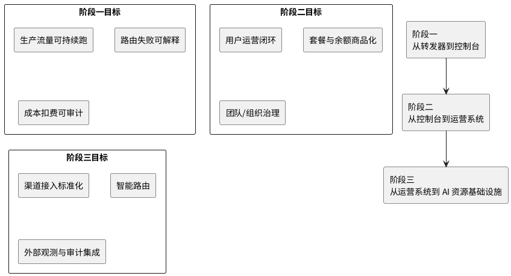

# 路由架构 V3

版本：`2026-08-03`  
状态：长期规划

本文档承载 Router 的长期定位、三阶段路线和未完成事项。当前实现基线见 [路由架构 V1](./路由架构V1.md)，下一阶段收敛目标见 [路由架构 V2](./路由架构V2.md)。

## 1. 长期定位

Router 未来不应只定位为“OpenAI 兼容转发器”或“多模型代理层”。

更准确的定位是：

**面向团队与运营场景的多模型接入、路由治理与商业化平台。**

Router 对齐统一模型入口的基础价值：

1. 一个 API 接入多个模型与供应商。
2. 统一模型目录与调用入口。
3. 路由、回退、协议兼容。
4. 基础可观测性与调用元数据。

但 Router 的长期差异化不应停在“支持更多模型”，而应建立在：

1. 运营治理。
2. 路由治理。
3. 私有化与本地化。

## 2. 产品边界

要做：

1. 多模型统一接入。
2. 路由策略与回退治理。
3. 供应商、渠道、模型治理。
4. 团队、租户、套餐、余额、权限。
5. 可观测性、成本治理、运营动作闭环。

暂时不作为主方向：

1. 纯消费级聊天产品。
2. 资讯型模型目录站。
3. 只以“更多协议 / 更多模型数量”为卖点。
4. 与 Router 主链路无关的大而全工作流编排。

## 3. 三阶段路线

## 4. 阶段一：从转发器到控制台

目标：让团队愿意把真实生产流量放进 Router。

核心建设：

1. 路由策略中心：Provider 优先级、Fallback 规则、模型别名、分组 / 套餐开放策略、区域和预算约束。
2. 路由可观测性：每次请求的真实命中链路、Fallback attempt 明细、成功率、时延、成本和错误归因。
3. 成本治理：每用户 / 每组 / 每套餐 / 每模型成本，高成本模型限流与替代策略。

阶段成果判断标准：

1. 生产流量可持续跑。
2. 运营和研发能解释“为什么这么路由”。
3. 发生失败时能快速归因。

## 5. 阶段二：从控制台到运营系统

目标：让运营、商务和团队管理员每天都会使用 Router。

核心建设：

1. 用户运营闭环：用户画像、用户分层、高消费 / 高活跃 / 长尾 / 沉默识别、批量加额 / 发码 / 分配套餐 / 导出名单。
2. 商品化：套餐模板、模型能力包、渠道化商品、代码 / 绘图 / 推理等场景包。
3. 多租户与组织管理：团队 / 项目 / 成员 / 角色、项目级 token、部门预算、子账户分摊。

阶段成果判断标准：

1. 用户、套餐、余额和模型能力形成闭环。
2. 运营动作不需要离开 Router。
3. 商品化与路由策略能统一联动。

## 6. 阶段三：从运营系统到 AI 资源基础设施

目标：把 Router 做成可扩展的 AI 接入基础设施，而不只是单体后台。

核心建设：

1. 渠道 / Provider 市场化基础能力：渠道接入标准化、模型能力发现、健康度与质量评分、价格与质量对比。
2. 智能路由：面向成本目标、SLA、套餐权益和组织策略的自动路由。
3. 外部观测与审计集成：Langfuse、Helicone、数据仓库、企业审计系统。

阶段成果判断标准：

1. Router 对外成为平台级中台。
2. 外部系统能稳定集成。
3. 路由与治理逻辑可以标准化复用。

## 7. 近期执行原则

近期只推进能开发、能验收、能复盘的事项：

1. 优先补运营闭环：看见问题、定位对象、进入明细、执行动作、留下记录。
2. 优先补路由可解释性：解释命中模型、命中渠道、fallback、失败、成本和扣费口径。
3. 每个事项必须可验收：页面可见、接口返回字段可核对、数据库记录可追溯、操作后状态变化明确、测试覆盖核心分支。

## 8. 未完成事项

### P0

1. 路由策略治理：清晰区分请求内切换、运行时禁用、账务刷新和人工关闭；继续增强端点支持状态、禁用原因、恢复状态和熔断事件可视化。
2. 充值与兑换链路定稿：统一外部支付下单、兑换码核销入账、补偿、发码责任边界和状态机文案。
3. 日志与路由解释：补齐请求路由字段和日志详情路由解释区，覆盖成功、失败、fallback 三类日志。
4. 余额不足自动禁用与恢复：保持自动禁用、恢复探测、状态记录和人工禁用边界清楚。

### P1

1. 汇率治理：补主备来源、失败重试、降级告警、汇率快照和同步执行记录。
2. 复杂缓存计费治理：区分请求内 usage、资源型缓存和周期型存储费，不把长期缓存费用伪装成单次模型调用 token。
3. 余额账本治理：管理员用户详情页余额批次补分页和来源下钻。
4. 钱包地址身份约束收口：补大小写无关唯一约束、历史数据清洗、重复账号资产归并和审计记录。
5. 套餐可见范围与名单保留：支持全部可见 / 部分可见切换，并保留历史名单。
6. 路由策略中心第一版：分组模型、分组渠道、`/v1/models` 和实际路由保持一致。
7. 成本与毛利基础视图：统一用户消费、用户充值、套餐收入、渠道成本、模型成本和毛利口径。

### P2

1. 半成品渠道协议 / 适配器收口：补齐或收起 `Cohere`、`Cloudflare`、`Replicate` 等实验性协议。
2. 历史兼容分支清理：逐步删除 `quota` 和旧返回字段兼容读取逻辑。
3. Tokenizer 远期精度演进：本地估算偏差不可接受时，再评估官方 tokenizer sidecar 或独立 tokenizer 服务。
4. 异常待办入口：支持余额风险用户、套餐即将过期、渠道余额不足、模型测试失败等可处理事项。

## 9. 维护方式

1. 产品方向调整优先更新本文档，再改具体页面和专题文档。
2. 新增模块前先判断它属于路由治理、运营治理、商品化还是基础设施。
3. 近期目标进入 [路由架构 V2](./路由架构V2.md)，长期路线和未完成事项进入本文档。
4. 已完成事项应从本文档移出，并回写到 V1 或对应专题文档。
